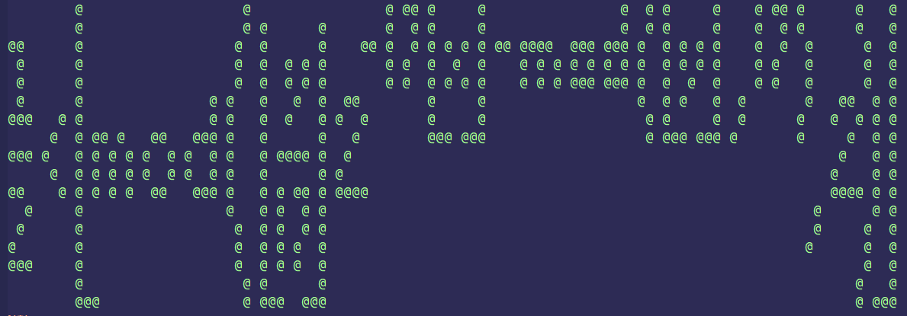

# cl-tupper

Implementation of **Tupper's self-referential formula** in Common Lisp (SBCL).

Tupper's self-referential formula is a formula that visually represents itself when graphed on plane.

See [Wikipedia](https://en.wikipedia.org/wiki/Tupper%27s_self-referential_formula) or [Worlfram MathWorld](https://mathworld.wolfram.com/TuppersSelf-ReferentialFormula.html).

Formula:

SBCL supports 'big' integers, which allows implementing the formula directly:

Output:

Any comment? Open an [issue](https://github.com/occisn/cl-tupper/issues), or start a discussion [here](https://github.com/occisn/cl-tupper/discussions) or [at profile level](https://github.com/occisn/occisn/discussions).
   
(end of README)
